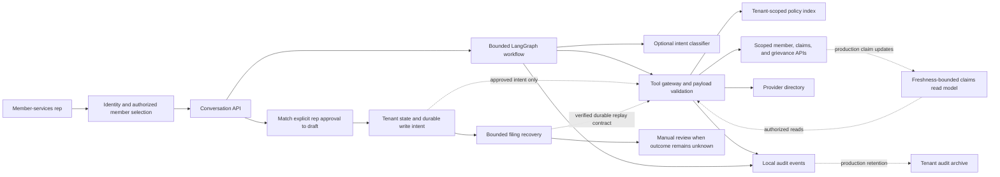

# Architecture diagram

```mermaid
flowchart LR
    Rep[Member-services rep] --> Identity[Identity and authorized member selection]
    Identity --> API[Conversation API]
    API --> Graph[Bounded LangGraph workflow]
    Graph --> Model[Optional intent classifier]
    Graph --> Policy[Tool gateway and payload validation]
    Policy --> KB[Tenant-scoped policy index]
    Policy --> APIs[Scoped member, claims, and grievance APIs]
    Policy --> Directory[Provider directory]
    APIs -. production claim updates .-> Projection[Freshness-bounded claims read model]
    Projection -. authorized reads .-> Policy
    API --> Approval[Match explicit rep approval to draft]
    Approval --> State[Tenant state and durable write intent]
    State -. approved intent only .-> Policy
    State --> Recovery[Bounded filing recovery]
    Recovery -. verified durable replay contract .-> Policy
    Recovery --> Manual[Manual review when outcome remains unknown]
    Policy --> Audit[Local audit events]
    Graph --> Audit
    Audit -. production retention .-> Archive[Tenant audit archive]
```
